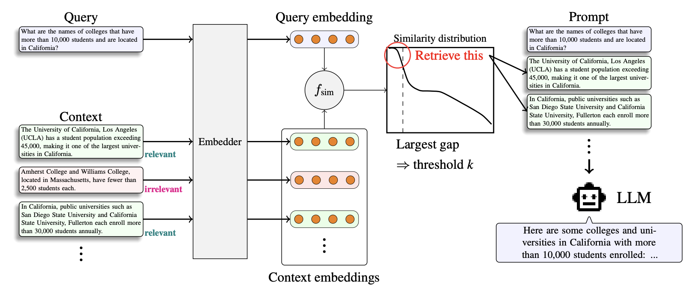

# Adaptive-k Retrieval
📄**Efficient Context Selection for Long-Context QA: No Tuning, No Iteration, Just Adaptive-*k***
- Authors: Chihiro Taguchi, Seiji Maekawa, Nikita Bhutani
- Conference: [EMNLP 2025](https://2025.emnlp.org/)
- Paper link: https://arxiv.org/abs/2506.08479

## TL;DR
A simple yet effective method to dynamically select the retrieval amount by algorithmically thresholding similarity scores.

## Overview
This repository contains the official implementation and experimental code for our paper "**Efficient Context Selection for Long-Context QA: No Tuning, No Iteration, Just Adaptive-*k***" accepted at [EMNLP 2025](https://2025.emnlp.org/) Main.



## Key contributions
- We propose Adaptive-*k*, a simple yet effective plug-and-play method for adaptive document retrieval that dynamically adjusts context size based on similarity distribution statistics.
- Adaptive-k achieves higher accuracy than prior methods and up to 99% token reduction on factoid and aggregation QA against LCLMs with full context.
- We show that no single fixed-size retrieval strategy fits all settings. In contrast, Adaptive-*k* shows robust performance across multiple LLMs, embedding models and benchmarks.

## Repository Structure
```
├── adaptive-k-retrieval/ # Main source code for adaptive-k.
│   ├── general_scripts/ # Scripts used in the experiments.
│   │   ├── run_eval_experiments.sh # an example evaluation script
│   │   ├── run_eval_holobench.sh # an example evaluation script for HoloBench
│   │   ├── run_holobench.sh # an example generation script for HoloBench
│   │   ├── run_qa.sh # an example generation script for HELMET QA tasks
│   ├── prompts/ # Prompt templates used in the experiments,
│   ├── retriever.py # the Retriever module.
│   ├── task_loader.py # for loading the dataset for a specific task.
│   ├── solve.py # Run adaptive RAG for HELMET/HoloBench tasks, and save the results.
│   ├── eval.py # Evaluate the saved RAG results.
│   ├── load_context.py # For generating context for the Holobench task.
│   ├── llm_as_a_judge.py # for LLM-as-a-judge evaluation in the Holobench task.
│   ├── make_vector_database.py # for creating and pre-saving the vector database of the datasets.
│   └── utils.py # Other utility functions
│   └── classifier.py # Classifier module, which is deprecated and not used in the study but is left as legacy
├── requirements.txt # Python dependencies
├── setup.py # Package installation script
├── img/ # Workflow image (irrelevant to the experiments)
└── README.md # This file
```
<!-- ├── models/                 # Model implementations -->
<!-- ├── experiments/            # Experimental configurations and scripts -->
<!-- ├── results/               # Output results and analysis -->
<!-- ├── notebooks/             # Jupyter notebooks for analysis and visualization -->

## Installation

### Prerequisites
The recommended Python version is 3.12.

### Setup
The required packages are listed in `requirements.txt`.
The following setup is based on `conda` to manage the environment; if you do not have `conda` installed, please follow the [official installation instructions](https://docs.conda.io/projects/conda/en/latest/user-guide/install/index.html) if you want to run the code under the same conditions as ours.
To simulate the environment, on your terminal simply run:

```
conda create -n adaptive-k python=3.12
conda activate adaptive-k
pip install git+https://github.com/megagonlabs/adaptive-k-retrieval.git
```

Also, if you want to prepare a vector database with FAISS, you can optionally run:
```
conda install -c pytorch faiss-cpu
```
The officially recommended way to install faiss-gpu is through `conda`, so we are not using `pip` here.
If your computing environment has a GPU and you want to use it, consider running `conda install -c pytorch faiss-gpu` instead of the above command.
For more information, see the [official documentation](https://faiss.ai/index.html).

## Dataset
In the experiments, we mainly use the following two publicly available datasets:
- HELMET [(Yen et al. 2024)](https://arxiv.org/abs/2410.02694)
  - HELMET (How to Evaluate Long-context Models Effectively and Thoroughly) is a comprehensive long-context LLM benchmark. Of its tasks, we use Natural Questions, TriviaQA, and HotpotQA.
  - See their [Repo](https://github.com/princeton-nlp/HELMET) for the instructions on downloading the dataset.
- HoloBench [(Maekawa et al. 2024)](https://arxiv.org/abs/2410.11996)
  - HoloBench is a long-context LLM benchmark for evaluating performance on aggregation QA tasks 
  - See their [Repo](https://github.com/megagonlabs/holobench) for the instructions on downloading the dataset.
  
| ID  | OSS Component Name | Modified | Copyright Holder | Upstream Link | License  |
|-----|----------------------------------|----------|------------------|-----------------------------------------------------------------------------------------------------------|--------------------|
| 1 | HELMET | No | Princeton Natural Language Processing | [link](https://github.com/princeton-nlp/HELMET) | MIT License |
| 2 | HoloBench | No | Megagon Labs | [link](https://github.com/megagonlabs/holobench) | BSD-3-Clause license | 


<!--## Evaluation
To reproduce the evaluation experiments done in the paper, ... TBA

## Experimental Results
TBA
-->
## Citation
The citation below is generated by arXiv.
The citation will be changed to the one published by the EMNLP proceedings once they are published.

```
@misc{taguchi2025efficientcontextselectionlongcontext,
      title={Efficient Context Selection for Long-Context QA: No Tuning, No Iteration, Just Adaptive-$k$}, 
      author={Chihiro Taguchi and Seiji Maekawa and Nikita Bhutani},
      year={2025},
      eprint={2506.08479},
      archivePrefix={arXiv},
      primaryClass={cs.CL},
      url={https://arxiv.org/abs/2506.08479}, 
}
```

## License
This project is licensed under the BSD 3-Clause License - see the LICENSE file for details.

## Contact
For questions or issues, feel free to contact ctaguchi@nd.edu (Chihiro Taguchi).
You may also open an issue in this repository on GitHub.

## Acknowledgments
This work was done during the first author's internship at Megagon Labs.
We thank Hayate Iso, Pouya Pezeshkpour, and the members at Megagon Labs for their constructive feedback.

## 📝 Changelog
v1.0.0 🎉
- ✨ Initial release with paper acceptance.

## 📜 Disclosure
Embedded in, or bundled with, this product are open source software (OSS) components, datasets and other third party components identified below. The license terms respectively governing the datasets and third-party components continue to govern those portions, and you agree to those license terms, which, when applicable, specifically limit any distribution. You may receive a copy of, distribute and/or modify any open source code for the OSS component under the terms of their respective licenses, which may be BSD 3 clause license and Apache 2.0 license. In the event of conflicts between Megagon Labs, Inc., license conditions and the Open Source Software license conditions, the Open Source Software conditions shall prevail with respect to the Open Source Software portions of the software. 
You agree not to, and are not permitted to, distribute actual datasets used with the OSS components listed below. You agree and are limited to distribute only links to datasets from known sources by listing them in the datasets overview table below. You are permitted to distribute derived datasets of data sets from known sources by including links to original dataset source in the datasets overview table below. You agree that any right to modify datasets originating from parties other than Megagon Labs, Inc. are governed by the respective third party’s license conditions. 
All OSS components and datasets are distributed WITHOUT ANY WARRANTY, without even implied warranty such as for MERCHANTABILITY or FITNESS FOR A PARTICULAR PURPOSE, and without any liability to or claim against any Megagon Labs, Inc. entity other than as explicitly documented in this README document. You agree to cease using any part of the provided materials if you do not agree with the terms or the lack of any warranty herein.
While Megagon Labs, Inc., makes commercially reasonable efforts to ensure that citations in this document are complete and accurate, errors may occur. If you see any error or omission, please help us improve this document by sending information to contact_oss@megagon.ai.
